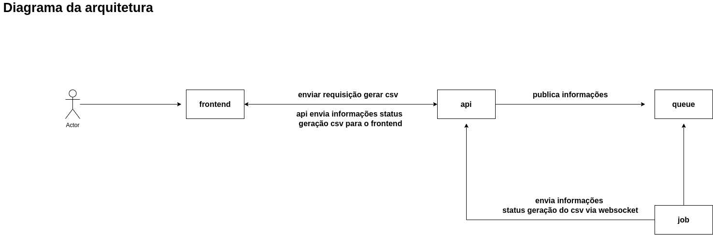

About
=======

- The project show example how you can feed about generate report while processing to customer.

Instruction to running the project locally:
===========================================

- Clone
- Execute command **npm i** inside directories **backend** and **frontend**
- Create **.env** file based **.env.example** file inside directories **backend** and **frontend**
- Execute command inside backend **docker-compose up -d** up redis database
- Execute command inside backend **npm run start:dev** up server
- Execute command inside backend **npm run job:dev** run workers
- Execute command inside frontend **npm run start** run workers

Diagram architecture:
======================

